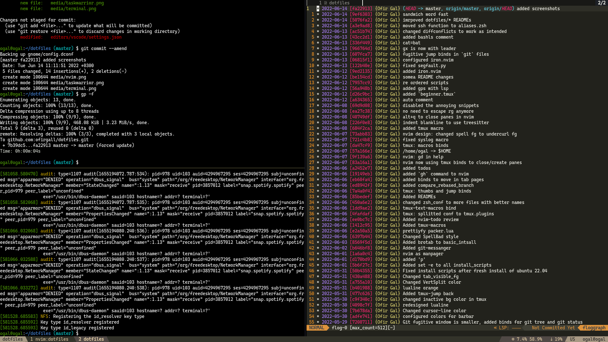
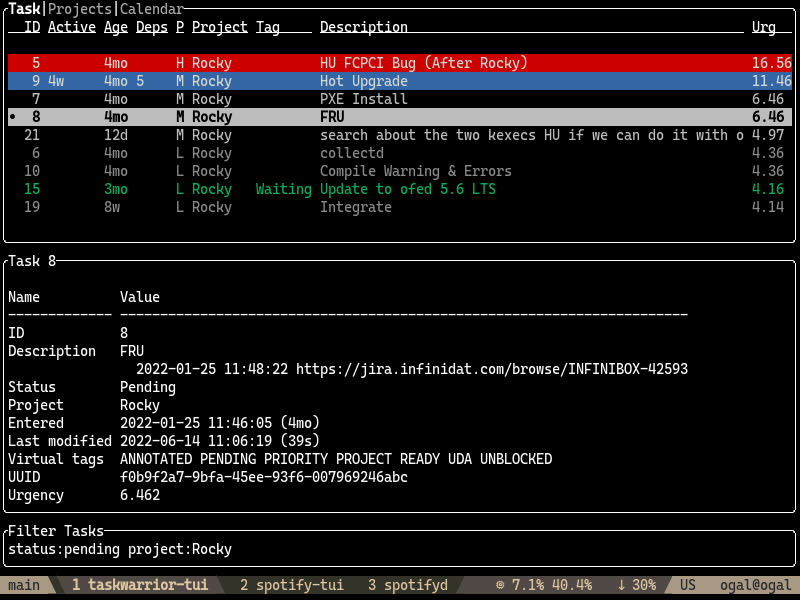

# Ofir's DotFiles

# Editor - [Neovim (nvim)](https://github.com/neovim/neovim)


# Terminal - [alacritty](https://github.com/alacritty/alacritty) with [tmux](https://github.com/tmux/tmux) that runs [zsh](https://wiki.archlinux.org/title/zsh) with [zinit](https://github.com/zdharma-continuum/zinit)


# Task Managment - [taskwarrior-tui](https://github.com/kdheepak/taskwarrior-tui)


# My Workflow
Each workspace usually has 2 windows, terminal with tmux session attached and a webbrowser attached to the tmux session by [tmux-browser](https://github.com/ofirgall/tmux-browser).
The only workspace that uas more 2 windows is the `main` session which runs `slack`, `spotify` and other GUIS I must use. \
I jump between the workspace fast with [tmux-go](https://github.com/ofirgall/tmux-browser)

---

# WARNING
This repo is mainly for saving my dotfiles, I don't recommend to clone and install it. \
Feel free to use it as reference to your own dotfiles/config setup

## Custom Key Mapping
Done by ~/awesomewm/autorun.sh:
* Capslock is mapped to Escape - Don't move your hands when escaping insert mode.
* Super+RightShift - Don't move your hands while typing.
* Right Alt is mapped to backspace - Same idea.. (done with ~/.xmodmap)

---

# Install
### Enable pre-commit hook for saving stuff
```bash
ln -s ../../pre-commit .git/hooks/pre-commit
```

### Set Git User
Set your `global` git user at ~/.git_user
```
[user]
	name = "Your Name"
	email = "yourname@gmail.com"
```

### Clone and Run
#### Config
* `touch ~/.remote_indicator` - if remote
* `touch ~/.no_sudo_indicator` - if no sudo on machine
```bash
git clone https://github.com/ofirgall/dotfiles.git && cd dotfiles && ./install
```

### Install TamperMonkey scripts
* Install [TamperMonkey](https://www.tampermonkey.net/)
* View the the [tampermonkey scripts](tampermonkey) as raw

## TODO Clean
* on top of each setup have the githublink
* require standard
* everything to "
* change folder structure (make some thinking)
	* packer.lua -> plugin_list.lua (in main)

---
## TODO
### Important
* git - script for setting upstream remote in a fork
* git - script for changing http to ssh + set git user
* git - change the default git user to personal, and workspace to other
---
* tmux - remove notifcation color in nova, to recreate attach to same session from two other windows (tmux link-window) and run stuff on the linked window
* tmux - get all the command lines that ran in this window and let you choose from fzf pop up
* tmux - plugin to add relative line numbers in copy mode
* playgrounds - create them on first install, like `cg` choose a language and open nvim in left side of tmux and right side leave a pane for run/compile
* tmux - control window size like nvim

## TODO Takes time
* tmux - relative numbers in copy mode
* tmux - Neo-Oli/tmux-text-macros integrate tmux fzf menu
* tmux - Neo-Oli/tmux-text-macros better syntax for custom-macros
* zellij
* git squash - if master/base branch moved forward can't find the ref
* tuis to try - slack, mail, calander, jira
* tmux-go
* when opening link ask to which session (can be in taskopen shortcut for now and later inside tmux-browser (maybe a webbrowser wrapper))
* backup non-dotfiles - tmux sessions, tasks of taskwarrior, nvim sessions
* backup firefox extnesions & settings
* tmux - better session workflow, session per feature:repo, fzf for features -> fzf for repo
* convert todos to tasks/issues

